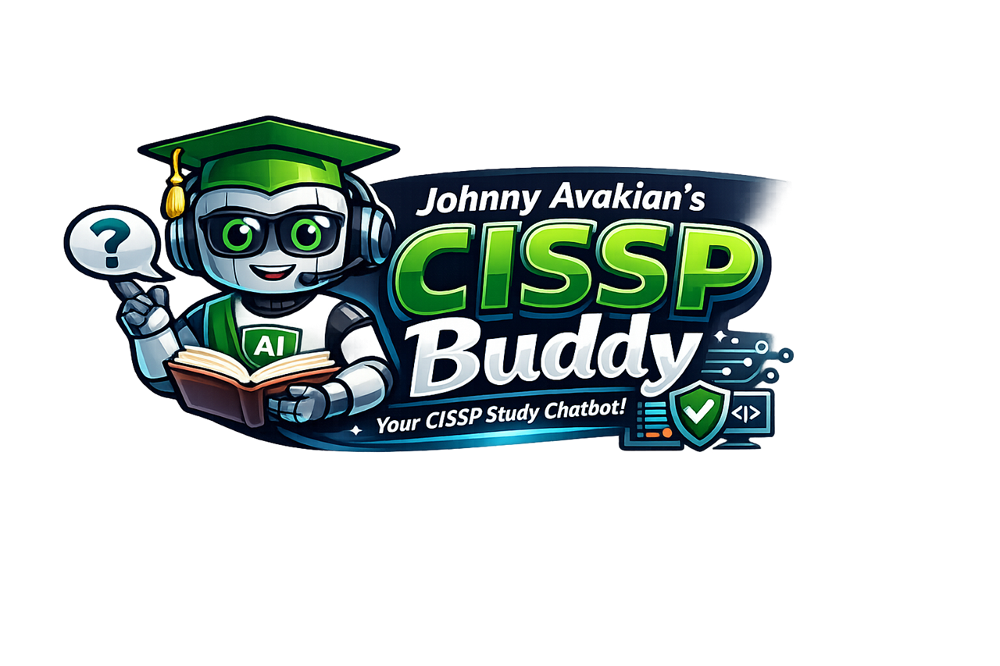

# Johnny Avakian's CISSP Buddy



Johnny Avakian's CISSP Buddy is a mission-driven Visual Studio Code study companion built to help CISSP candidates study better, think more clearly, and succeed on the exam. It opens as a standalone app inside VS Code, explains CISSP topics in exam-friendly language, runs guided multi-question quizzes, exports transcripts to PDF, and generates professional LinkedIn posts from the topic you studied.

## What This Product Is Built To Do

- Give CISSP candidates clearer explanations and stronger exam reasoning
- Reinforce retention with guided multi-question quizzes instead of one-off answers
- Keep the assistant safely scoped to CISSP and defensive security
- Turn study sessions into reusable notes, PDF reviews, and thoughtful LinkedIn reflections
- Provide polished, well-documented tooling that users and maintainers can trust

## Feature Summary

- Standalone app experience inside VS Code instead of a plain chat thread
- Configurable quiz length from `1` to `10` questions per study topic
- Floating study composer dock with an open or collapse control for smaller screens
- Shorthand topic resolution for prompts like `fm-200`, with a second-stage security relevance check
- LinkedIn draft controls available both in the LinkedIn panel and directly in the floating composer
- Quiz-aware LinkedIn controls that tell the user to answer the current question before drafting a post
- Transcript-based LinkedIn draft cards that show the generated post alongside `hero.png`
- Download actions for both the generated LinkedIn post and the branded hero image
- Optional detailed explanations for all three wrong answer choices
- Interactive answer review with follow-up questions until the selected quiz count is complete
- LinkedIn post generator based on the last studied topic, with composer fallback before a session starts
- PDF export for study review, mentoring, and saved notes
- In-app documentation with direct links to GitHub docs
- Website, support, LinkedIn, repo-star, and referral links
- Guardrails that keep the assistant focused on CISSP and defensive security guidance

## Foolproof Quick Start

### Runtime Requirements

- Visual Studio Code `1.110.0` or newer
- GitHub Copilot Chat installed and signed in
- Node.js
- npm

### First-Time Setup

1. Clone the repository
2. Install dependencies:

```bash
npm install
```

3. Compile the extension:

```bash
npm run compile
```

4. Launch the Extension Development Host:

- Press `F5` in VS Code

5. Open the app in the development host:

- Command Palette: `Johnny Avakian's CISSP Buddy: Open Study App`
- Or in Copilot Chat: `/cissp-buddy`

### Packaging And Local Install

Create a VSIX package:

```bash
npx @vscode/vsce package --no-yarn
```

Install the packaged extension:

```bash
code --install-extension cissp-buddy-0.0.18.vsix --force
```

If VS Code still shows the previous version after install, run `Developer: Reload Window`.

## Documentation Index

- [User Guide](docs/USER_GUIDE.md)
- [FAQ](docs/FAQ.md)
- [Troubleshooting Guide](docs/TROUBLESHOOTING.md)
- [Architecture Overview](docs/ARCHITECTURE.md)
- [Launching And Releasing](docs/LAUNCHING.md)
- [Demo Script](docs/DEMO_SCRIPT.md)

## Recommended Reading Order

If you want to understand the product's mission, workflow, and implementation, this is the fastest path:

1. Read this README for the product and setup summary
2. Open [docs/USER_GUIDE.md](docs/USER_GUIDE.md) to understand the actual study flow
3. Open [docs/FAQ.md](docs/FAQ.md) for the practical design and behavior questions users and maintainers usually ask
4. Open [docs/ARCHITECTURE.md](docs/ARCHITECTURE.md) for the implementation model
5. Open [docs/LAUNCHING.md](docs/LAUNCHING.md) for build, packaging, install, validation, and release steps
6. Open [docs/DEMO_SCRIPT.md](docs/DEMO_SCRIPT.md) for a clean product walkthrough
7. Use [docs/TROUBLESHOOTING.md](docs/TROUBLESHOOTING.md) if setup or runtime issues appear

## Documentation Promise

The documentation is intentionally split so each audience can find what they need quickly:

- End users should start with the User Guide and FAQ
- Maintainers and collaborators should read the README, Architecture Overview, and Launching guide
- The Demo Script is there for interviews, product walkthroughs, and LinkedIn posts
- In-app documentation mirrors this structure so the product remains clear during real study sessions and demos

## Website And Community Links

- Website: [codeavak.github.io/portfolio_website](https://codeavak.github.io/portfolio_website/)
- Support: [Buy Me a Coffee](https://buymeacoffee.com/codeavak)
- LinkedIn: [codeavak](https://www.linkedin.com/in/codeavak)
- Repo: [codeavak/cisspbuddy](https://github.com/codeavak/cisspbuddy)

Johnny is working on posting a CISSP prep blog on the website. Stars on the repo, comments on the blog, and support through Buy Me a Coffee are appreciated, and referrals for cybersecurity or senior engineer roles are especially welcome.
